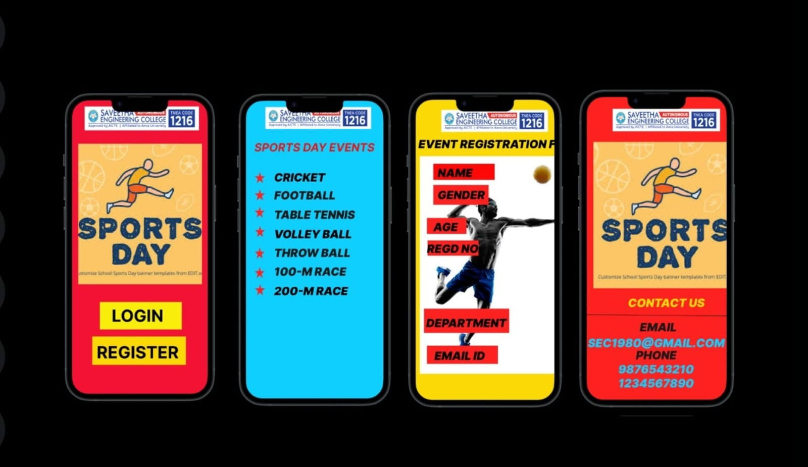

# Ex09 Event Registration Web Application
## Date:14-05-2025

## AIM:
To design, develop and deploy a web application for event registration.

## DESIGN STEPS:

### Step 1:
Create a new frame.

### Step 2:
Select any one preset size of your choice.

### Step 3:
Select the shapes you need.

### Step 4:
Import images as needed.

### Step 5:
Create pages based on your need and link them.

### Step 6:

Validate the HTML and CSS code.

### Step 6:

Publish the website in the given URL.

## DESIGN TOOL:
Figma

## CODE:
Home page
```
html code
<style>.container--0- {
  position: absolute;
  left: -240px;
  top: -384px;
  width: 390px;
  height: 844px;
  background-color: #f31234;
  justify-content: start;
  align-items: start;
}
.text-0-1-4 {
  width: 149px;
  height: 58px;
  color: #000000;
  font-size: 48px;
  font-family: Inter, "Bold";
  font-weight: 700;
  text-align: left;
  vertical-align: top;
}
.text-0-1-5 {
  width: 263px;
  height: 65px;
  color: #000000;
  font-size: 48px;
  font-family: Inter, "Bold";
  font-weight: 700;
  text-align: left;
  vertical-align: top;
}</style>
<div class="container--0-">
  <svg
    width="269"
    height="82"
    viewBox="0 0 269 82"
    fill="none"
    xmlns="http://www.w3.org/2000/svg"
  >
    <rect width="269" height="82" fill="#FAD906"></rect></svg
  ><svg
    width="235"
    height="79"
    viewBox="0 0 235 79"
    fill="none"
    xmlns="http://www.w3.org/2000/svg"
  >
    <rect width="235" height="79" fill="#F9ED0C"></rect>
  </svg>
  <div class="text-0-1-4">LOGIN</div>
  <div class="text-0-1-5">REGISTER</div>
</div>
```
Event page
```
<style>.container--0- {
  position: absolute;
  left: 189px;
  top: -384px;
  width: 390px;
  height: 844px;
  background-color: #0fcfff;
  justify-content: start;
  align-items: start;
}
.text-0-1-1 {
  width: 341px;
  height: 39px;
  color: #e5181b;
  font-size: 32px;
  font-family: Inter, "Bold Italic";
  font-weight: 700;
  text-align: left;
  vertical-align: top;
}
.text-0-1-3 {
  width: 145px;
  height: 39px;
  color: #1a0102;
  font-size: 32px;
  font-family: Inter, "Black Italic";
  font-weight: 900;
  text-align: left;
  vertical-align: top;
}
.text-0-1-5 {
  width: 174px;
  height: 39px;
  color: #1b1818;
  font-size: 32px;
  font-family: Inter, "Black Italic";
  font-weight: 900;
  text-align: left;
  vertical-align: top;
}
.text-0-1-9 {
  width: 230px;
  height: 39px;
  color: #1b1818;
  font-size: 32px;
  font-family: Inter, "Black Italic";
  font-weight: 900;
  text-align: left;
  vertical-align: top;
}
.text-0-1-10 {
  width: 221px;
  height: 39px;
  color: #000000;
  font-size: 32px;
  font-family: Inter, "Black Italic";
  font-weight: 900;
  text-align: left;
  vertical-align: top;
}
.text-0-1-11 {
  width: 217px;
  height: 78px;
  color: #1b1818;
  font-size: 32px;
  font-family: Inter, "Black Italic";
  font-weight: 900;
  text-align: left;
  vertical-align: top;
}
.text-0-1-14 {
  width: 205px;
  height: 39px;
  color: #1b1818;
  font-size: 32px;
  font-family: Inter, "Black Italic";
  font-weight: 900;
  text-align: left;
  vertical-align: top;
}
.text-0-1-15 {
  width: 210px;
  height: 39px;
  color: #000000;
  font-size: 32px;
  font-family: Inter, "Black Italic";
  font-weight: 900;
  text-align: left;
  vertical-align: top;
}</style>
<div class="container--0-">
  
  <div class="text-0-1-1">SPORTS DAY EVENTS</div>
  <svg
    width="31"
    height="32"
    viewBox="0 0 31 32"
    fill="none"
    xmlns="http://www.w3.org/2000/svg"
  >
    <path
      d="M15.5 0L18.98 12.0922L30.2414 12.0922L21.1307 19.5656L24.6107 31.6578L15.5 24.1844L6.38933 31.6578L9.8693 19.5656L0.758624 12.0922L12.02 12.0922L15.5 0Z"
      fill="#FF2020"
    ></path>
  </svg>
  <div class="text-0-1-3">CRICKET</div>
  <svg
    width="31"
    height="32"
    viewBox="0 0 31 32"
    fill="none"
    xmlns="http://www.w3.org/2000/svg"
  >
    <path
      d="M15.5 0L18.98 12.0922L30.2414 12.0922L21.1307 19.5656L24.6107 31.6578L15.5 24.1844L6.38933 31.6578L9.8693 19.5656L0.758624 12.0922L12.02 12.0922L15.5 0Z"
      fill="#FF2020"
    ></path>
  </svg>
  <div class="text-0-1-5">FOOTBALL</div>
  <svg
    width="30"
    height="32"
    viewBox="0 0 30 32"
    fill="none"
    xmlns="http://www.w3.org/2000/svg"
  >
    <path
      d="M15 0L18.3677 12.0922L29.2658 12.0922L20.4491 19.5656L23.8168 31.6578L15 24.1844L6.18322 31.6578L9.55093 19.5656L0.734152 12.0922L11.6323 12.0922L15 0Z"
      fill="#FF2020"
    ></path></svg
  ><svg
    width="30"
    height="32"
    viewBox="0 0 30 32"
    fill="none"
    xmlns="http://www.w3.org/2000/svg"
  >
    <path
      d="M15 0L18.3677 12.0922L29.2658 12.0922L20.4491 19.5656L23.8168 31.6578L15 24.1844L6.18322 31.6578L9.55093 19.5656L0.734152 12.0922L11.6323 12.0922L15 0Z"
      fill="#FF2020"
    ></path></svg
  ><svg
    width="30"
    height="32"
    viewBox="0 0 30 32"
    fill="none"
    xmlns="http://www.w3.org/2000/svg"
  >
    <path
      d="M15 0L18.3677 12.0922L29.2658 12.0922L20.4491 19.5656L23.8168 31.6578L15 24.1844L6.18322 31.6578L9.55093 19.5656L0.734152 12.0922L11.6323 12.0922L15 0Z"
      fill="#FF2020"
    ></path>
  </svg>
  <div class="text-0-1-9">TABLE TENNIS</div>
  <div class="text-0-1-10">VOLLEY BALL</div>
  <div class="text-0-1-11">THROW BALL<br /></div>
  <svg
    width="30"
    height="32"
    viewBox="0 0 30 32"
    fill="none"
    xmlns="http://www.w3.org/2000/svg"
  >
    <path
      d="M15 0L18.3677 12.0922L29.2658 12.0922L20.4491 19.5656L23.8168 31.6578L15 24.1844L6.18322 31.6578L9.55093 19.5656L0.734152 12.0922L11.6323 12.0922L15 0Z"
      fill="#FF2020"
    ></path></svg
  ><svg
    width="30"
    height="32"
    viewBox="0 0 30 32"
    fill="none"
    xmlns="http://www.w3.org/2000/svg"
  >
    <path
      d="M15 0L18.3677 12.0922L29.2658 12.0922L20.4491 19.5656L23.8168 31.6578L15 24.1844L6.18322 31.6578L9.55093 19.5656L0.734152 12.0922L11.6323 12.0922L15 0Z"
      fill="#FF2020"
    ></path>
  </svg>
  <div class="text-0-1-14">100-M RACE</div>
  <div class="text-0-1-15">200-M RACE</div>
</div>
```
Event Registration Form
```
<style>.container--0- {
  position: absolute;
  left: 629px;
  top: -384px;
  width: 477px;
  height: 844px;
  background-color: #fad906;
  justify-content: start;
  align-items: start;
}
.text-0-1-1 {
  width: 462px;
  height: 39px;
  color: #000000;
  font-size: 32px;
  font-family: Inter, "Black Italic";
  font-weight: 900;
  text-align: left;
  vertical-align: top;
}
.text-0-1-4 {
  width: 99px;
  height: 39px;
  color: #000000;
  font-size: 32px;
  font-family: Inter, "Black Italic";
  font-weight: 900;
  text-align: left;
  vertical-align: top;
}
.text-0-1-6 {
  width: 133px;
  height: 39px;
  color: #000000;
  font-size: 32px;
  font-family: Inter, "Black Italic";
  font-weight: 900;
  text-align: left;
  vertical-align: top;
}
.text-0-1-8 {
  width: 69px;
  height: 39px;
  color: #000000;
  font-size: 32px;
  font-family: Inter, "Black Italic";
  font-weight: 900;
  text-align: left;
  vertical-align: top;
}
.text-0-1-10 {
  width: 154px;
  height: 39px;
  color: #000000;
  font-size: 32px;
  font-family: Inter, "Black Italic";
  font-weight: 900;
  text-align: left;
  vertical-align: top;
}
.text-0-1-12 {
  width: 226px;
  height: 39px;
  color: #000000;
  font-size: 32px;
  font-family: Inter, "Black Italic";
  font-weight: 900;
  text-align: left;
  vertical-align: top;
}
.text-0-1-14 {
  width: 142px;
  height: 39px;
  color: #000000;
  font-size: 32px;
  font-family: Inter, "Black Italic";
  font-weight: 900;
  text-align: left;
  vertical-align: top;
}</style>
<div class="container--0-">
  <svg
    width="172"
    height="45"
    viewBox="0 0 172 45"
    fill="none"
    xmlns="http://www.w3.org/2000/svg"
  >
    <rect width="172" height="45" fill="#FF0707"></rect>
  </svg>
  <div class="text-0-1-4">NAME</div>
  <svg
    width="155"
    height="56"
    viewBox="0 0 155 56"
    fill="none"
    xmlns="http://www.w3.org/2000/svg"
  >
    <rect width="155" height="56" fill="#FF2020"></rect>
  </svg>
  <div class="text-0-1-6">GENDER</div>
  <svg
    width="111"
    height="45"
    viewBox="0 0 111 45"
    fill="none"
    xmlns="http://www.w3.org/2000/svg"
  >
    <rect width="111" height="45" fill="#FF2020"></rect>
  </svg>
  <div class="text-0-1-8">AGE</div>
  <svg
    width="143"
    height="43"
    viewBox="0 0 143 43"
    fill="none"
    xmlns="http://www.w3.org/2000/svg"
  >
    <rect width="143" height="43" fill="#FF2020"></rect>
  </svg>
  <div class="text-0-1-10">REGD NO.</div>
  <svg
    width="239"
    height="68"
    viewBox="0 0 239 68"
    fill="none"
    xmlns="http://www.w3.org/2000/svg"
  >
    <rect width="239" height="68" fill="#FF2020"></rect>
  </svg>
  <div class="text-0-1-12">DEPARTMENT</div>
  <svg
    width="199"
    height="51"
    viewBox="0 0 199 51"
    fill="none"
    xmlns="http://www.w3.org/2000/svg"
  >
    <rect width="199" height="51" fill="#FF2020"></rect>
  </svg>
  <div class="text-0-1-14">EMAIL ID</div>
</div>
```
Contacters page
```
<style>.container--0- {
  position: absolute;
  left: 1145px;
  top: -384px;
  width: 444px;
  height: 844px;
  background-color: #ff2020;
  justify-content: start;
  align-items: start;
}
.text-0-1-2 {
  width: 214px;
  height: 78px;
  color: #fad906;
  font-size: 32px;
  font-family: Inter, "Black Italic";
  font-weight: 900;
  text-align: left;
  vertical-align: top;
}
.text-0-1-4 {
  width: 103px;
  height: 39px;
  color: #1b1818;
  font-size: 32px;
  font-family: Inter, "Black Italic";
  font-weight: 900;
  text-align: left;
  vertical-align: top;
}
.text-0-1-5 {
  width: 382px;
  height: 39px;
  color: #0fcfff;
  font-size: 32px;
  font-family: Inter, "Black Italic";
  font-weight: 900;
  text-align: left;
  vertical-align: top;
}
.text-0-1-6 {
  width: 114px;
  height: 39px;
  color: #1b1818;
  font-size: 32px;
  font-family: Inter, "Black Italic";
  font-weight: 900;
  text-align: left;
  vertical-align: top;
}
.text-0-1-7 {
  width: 211px;
  height: 39px;
  color: #0fcfff;
  font-size: 32px;
  font-family: Inter, "Black Italic";
  font-weight: 900;
  text-align: left;
  vertical-align: top;
}
.text-0-1-8 {
  width: 211px;
  height: 39px;
  color: #0fcfff;
  font-size: 32px;
  font-family: Inter, "Black Italic";
  font-weight: 900;
  text-align: left;
  vertical-align: top;
}</style>
<div class="container--0-">
  
  <div class="text-0-1-2">CONTACT US<br /></div>
  <svg
    width="444"
    height="6"
    viewBox="0 0 444 6"
    fill="none"
    xmlns="http://www.w3.org/2000/svg"
  >
    <line
      x1="0.00459751"
      y1="0.500021"
      x2="449.986"
      y2="4.63778"
      stroke="black"
    ></line>
  </svg>
  <div class="text-0-1-4">EMAIL</div>
  <div class="text-0-1-5">SEC1980@GMAIL.COM</div>
  <div class="text-0-1-6">PHONE</div>
  <div class="text-0-1-7">9876543210</div>
  <div class="text-0-1-8">1234567890</div>
</div>
```


## OUTPUT:



## RESULT:
The program to design, develop and deploy a web application for event registration is completed successfully.
